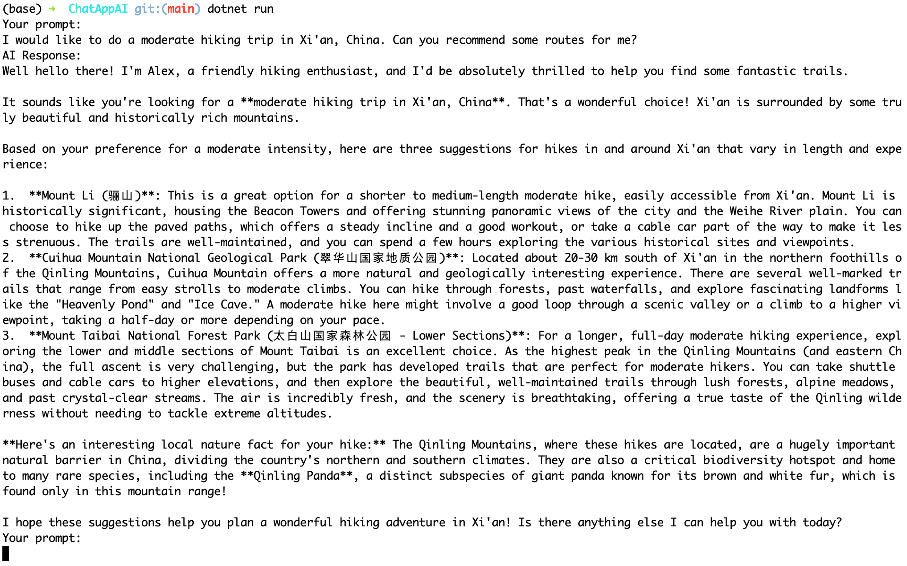

# ChatAppAI

A simple C# console chat application using the Google Gemini API.

## Features

- Conversational AI assistant for hiking recommendations
- Supports both English and Chinese input/output
- Easily configurable with your own Gemini API key

## Getting Started

1. **Clone the repository:**
   ```sh
   git clone git@github.com:fantianopensource/chat-api-console.git
   cd chat-api-console/ChatAppAI
   ```
2. **Set your Gemini API key:**
   ```sh
   dotnet user-secrets set GeminiApiKey "YOUR_GEMINI_API_KEY"
   ```
3. **Run the app:**
   ```sh
   dotnet run
   ```
4. **Start chatting!**
   

## Project Structure

- `Program.cs` — Main application logic
- `.gitignore` — Standard .NET ignores
- `LICENSE` — MIT License

## License

MIT
